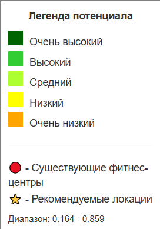
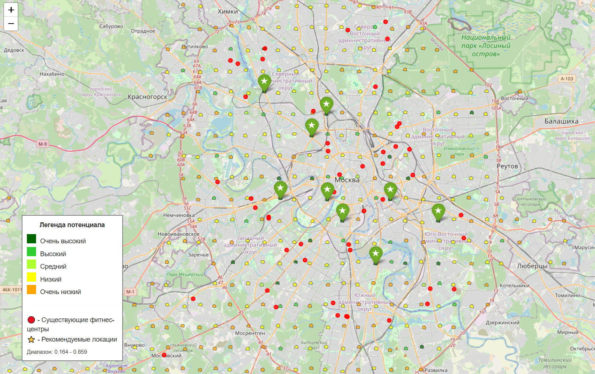

# 🏋️ Геомаркетинговый анализ для размещения фитнес-центров


Комплексная система для оценки потенциала городских территорий для размещения фитнес-центров с применением методов машинного обучения и геопространственного анализа.

## 📋 Оглавление

- [🎯 О проекте](#-о-проекте)
- [🚀 Основные возможности](#-основные-возможности)
- [🛠 Технологический стек](#-технологический-стек)
- [📊 Методология анализа](#-методология-анализа)
- [⚙️ Быстрый старт](#️-быстрый-старт)
- [💻 Использование](#-использование)
- [📁 Структура кода](#-структура-кода)
- [📈 Результаты и метрики](#-результаты-и-метрики)
- [🎨 Визуализация](#-визуализация)
- [🔧 Настройка параметров](#-настройка-параметров)
- [📄 Лицензия](#-лицензия)

## 🎯 О проекте

Данный проект решает задачу оптимального выбора местоположения для новых фитнес-центров на основе анализа геопространственных данных и машинного обучения. Система автоматически собирает данные об инфраструктуре, анализирует территорию и выдает рекомендации с оценкой потенциала.

### Проблема
- Субъективность традиционных методов оценки местоположения
- Высокие риски инвестиций (5-50 млн рублей за ошибку)
- Неучет скрытых пространственных закономерностей
- Отсутствие системного подхода к анализу территорий

### Решение
- 🤖 **Автоматизированный сбор** и анализ геоданных
- 📊 **Объективная оценка** на основе 25+ пространственных признаков
- 🎯 **Точные прогнозы** с использованием ML-моделей (78-84% точность)
- 📈 **Интегральный показатель** потенциала с учетом конкуренции

## 🚀 Основные возможности

### 📍 Ядро системы
- **Автоматический сбор данных** из OpenStreetMap
- **Гексагональное разбиение** территорий (H3)
- **Расчет 25+ пространственных признаков**
- **ML-моделирование** (Random Forest)
- **Кластерный анализ** (K-means)
- **Интегральная оценка** потенциала

### 🎯 Аналитические функции
- **Оценка транспортной доступности**
- **Анализ коммерческой инфраструктуры**
- **Учет социальных объектов**
- **Расчет плотности застройки**
- **Анализ конкуренции**
- **Категоризация потенциала**

### 📊 Визуализация
- **Интерактивные карты** с цветовой кодировкой
- **Диаграммы важности признаков**
- **Гистограммы распределения**
- **Сравнение кластеров**

## 🛠 Технологический стек

### 🐍 Основные технологии
- **Python 3.8+** - ядро системы
- **pandas & numpy** - обработка данных
- **scikit-learn** - машинное обучение
- **geopandas** - геопространственный анализ
- **osmnx** - работа с OpenStreetMap
- **h3** - гексагональные сетки

### 🗺️ Гео-инструменты
- **OpenStreetMap** - источник данных
- **H3 Uber** - пространственное индексирование
- **GeoPandas** - обработка геоданных
- **Folium** - интерактивные карты

### 📈 Визуализация
- **Matplotlib** - базовые графики
- **Seaborn** - статистическая визуализация
- **Folium** - веб-карты

## 📊 Методология анализа

### 🔄 Процесс анализа

```python
# Основные этапы анализа
1. 📥 Сбор данных OSM
2. 🏗️ Построение гексагональной сетки  
3. 🧮 Инженерия пространственных признаков
4. 🤖 Обучение ML-модели
5. 📊 Кластерный анализ
6. 📈 Расчет потенциала
7. 🎯 Формирование рекомендаций
```

### 📋 Система признаков (25+ показателей)

#### 🚦 Транспортная доступность
- `transport_within_500m` - остановки в радиусе 500м
- `transport_within_1000m` - остановки в радиусе 1000м
- `distance_to_nearest_transport` - расстояние до транспорта

#### 🏪 Коммерция и услуги
- `commerce_within_500m` - магазины, кафе, банки
- `commerce_density` - плотность коммерции

#### 🎓 Образование
- `education_within_500m` - школы, университеты
- `education_density` - плотность образовательных учреждений

#### 🏠 Жилье и офисы
- `residential_within_500m` - жилые здания
- `office_within_500m` - офисные центры
- Плотностные характеристики для всех типов застройки

#### ⚽ Досуг и спорт
- `leisure_within_500m` - парки, спортивные объекты
- `leisure_density` - плотность рекреационных зон

### 🤖 Машинное обучение

```python
# Модель Random Forest
model = RandomForestClassifier(
    n_estimators=100,
    random_state=42, 
    n_jobs=-1
)

# Метрики качества:
# ✅ ROC-AUC: 0.84 ± 0.03
# ✅ Точность: 78-84%
# ✅ Кросс-валидация: 3-fold
```

### 📐 Формула потенциала

```
Интегральный_потенциал = 0.7 × Привлекательность + 0.3 × (1 - Конкуренция)
```

Где:
- **Привлекательность** - прогноз ML-модели (0-1)
- **Конкуренция** - нормализованное количество фитнес-центров в радиусе 500м

## ⚙️ Быстрый старт

### 📋 Предварительные требования

- Python 3.8 или новее
- 8 ГБ оперативной памяти  
- 2 ГБ свободного места
- Интернет-соединение для загрузки данных OSM

### 🚀 Установка и запуск

```bash
# 1. Клонирование репозитория
git clone https://github.com/yourusername/fitness-location-analysis.git
cd fitness-location-analysis

# 2. Установка зависимостей
pip install pandas numpy geopandas osmnx h3 scikit-learn folium matplotlib seaborn

# 3. Запуск анализа
python main_script.py
```

### 💻 Запуск в Google Colab

```python
# Установка необходимых библиотек
!pip install osmnx geopandas h3 folium

# Запуск скрипта
!python main_script.py
```

## 💻 Использование

### 🎯 Базовое использование

```python
# Простой запуск для Москвы
from main_script import main

results = main()  # Запуск полного анализа

# Результаты доступны в словаре results:
print(f"Территорий проанализировано: {len(results['hex_grid'])}")
print(f"Рекомендаций сгенерировано: {len(results['top_locations'])}")
```

### ⚙️ Расширенная настройка

```python
# Поэтапный запуск с кастомизацией
from main_script import (
    GeoDataCollector, HexGridBuilder, FeatureEngineer,
    FitnessLocationModel, TerritoryClusterer, 
    PotentialCalculator, ResultsVisualizer
)

# 1. Настройка параметров
CITY = "Москва"
HEX_RESOLUTION = 9
RADII = [500, 1000]  # метры
TOP_LOCATIONS_COUNT = 10

# 2. Сбор данных
collector = GeoDataCollector(city_name=CITY)
city_boundary = collector.get_city_boundary()
collector.load_all_data()

# 3. Создание сетки
hex_builder = HexGridBuilder(resolution=HEX_RESOLUTION)
hex_grid = hex_builder.create_hex_grid(city_boundary)

# 4. Расчет признаков
feature_engineer = FeatureEngineer(hex_grid, collector.gdf_dict)
feature_engineer.calculate_spatial_features(radii=RADII)
features_df = feature_engineer.normalize_features().features_df

# 5. ML-моделирование
model = FitnessLocationModel()
features_with_target = model.prepare_target_variable(
    features_df, collector.gdf_dict["fitness_centers"], hex_grid
)
model.train(features_with_target, features_with_target['target'])

# 6. Кластеризация
clusterer = TerritoryClusterer(max_clusters=6)
optimal_clusters = clusterer.find_optimal_clusters(features_with_target)
cluster_labels, _ = clusterer.perform_clustering(features_with_target, optimal_clusters)

# 7. Расчет потенциала
potential_calculator = PotentialCalculator()
integral_potential, attractiveness, competition = potential_calculator.calculate(
    hex_grid, features_with_target, model, collector.gdf_dict["fitness_centers"]
)

# 8. Визуализация
visualizer = ResultsVisualizer(hex_grid, features_with_target)
top_locations = visualizer.get_top_recommendations(
    integral_potential, 
    n_recommendations=TOP_LOCATIONS_COUNT
)
interactive_map = visualizer.create_map(
    integral_potential, 
    collector.gdf_dict["fitness_centers"], 
    top_locations
)
interactive_map.save('fitness_location_recommendations.html')
```

## 📁 Структура кода

### 🏗️ Основные классы

#### 1. `GeoDataCollector` - сбор данных
```python
# Основные методы:
- get_city_boundary() - границы города
- get_osm_data() - данные из OSM
- load_all_data() - загрузка всей инфраструктуры
```

#### 2. `HexGridBuilder` - пространственная сетка
```python
# Основные методы:
- create_hex_grid() - создание H3 сетки
- _create_demo_hex_grid() - демо-режим
```

#### 3. `FeatureEngineer` - инженерия признаков
```python
# Основные методы:
- calculate_spatial_features() - расчет всех признаков
- _calculate_features_in_radius() - объекты в радиусе
- _calculate_distance_to_nearest() - расстояния до объектов
- _calculate_density_features() - плотностные характеристики
- normalize_features() - нормализация данных
```

#### 4. `FitnessLocationModel` - ML-модель
```python
# Основные методы:
- prepare_target_variable() - подготовка целевой переменной
- train() - обучение модели
- analyze_feature_importance() - анализ важности признаков
```

#### 5. `TerritoryClusterer` - кластеризация
```python
# Основные методы:
- find_optimal_clusters() - поиск оптимального числа кластеров
- perform_clustering() - выполнение кластеризации
```

#### 6. `PotentialCalculator` - расчет потенциала
```python
# Основные методы:
- calculate() - расчет интегрального потенциала
- categorize() - категоризация территорий
```

#### 7. `ResultsVisualizer` - визуализация
```python
# Основные методы:
- create_map() - создание интерактивной карты
- get_top_recommendations() - топ рекомендаций
- _add_legend() - добавление легенды
```

#### 8. `AnalysisReporter` - отчетность
```python
# Основные методы:
- create_comprehensive_visualization() - комплексная визуализация
- print_analysis_summary() - сводка анализа
```

### 🔄 Основной поток выполнения

```python
def main():
    # 1. Инициализация и сбор данных
    collector = GeoDataCollector("Москва")
    city_boundary = collector.get_city_boundary()
    collector.load_all_data()
    
    # 2. Подготовка пространственной сетки
    hex_grid = HexGridBuilder(resolution=9).create_hex_grid(city_boundary)
    
    # 3. Инженерия признаков
    feature_engineer = FeatureEngineer(hex_grid, collector.gdf_dict)
    feature_engineer.calculate_spatial_features(radii=[500, 1000])
    features_df = feature_engineer.normalize_features().features_df
    
    # 4. ML-моделирование
    model = FitnessLocationModel()
    features_with_target = model.prepare_target_variable(
        features_df, collector.gdf_dict["fitness_centers"], hex_grid
    )
    model.train(features_with_target, features_with_target['target'])
    
    # 5. Кластерный анализ
    clusterer = TerritoryClusterer(max_clusters=6)
    optimal_clusters = clusterer.find_optimal_clusters(features_with_target)
    cluster_labels, _ = clusterer.perform_clustering(features_with_target, optimal_clusters)
    
    # 6. Расчет потенциала
    potential_calculator = PotentialCalculator()
    integral_potential, attractiveness, competition = potential_calculator.calculate(
        hex_grid, features_with_target, model, collector.gdf_dict["fitness_centers"]
    )
    potential_categories = potential_calculator.categorize(integral_potential)
    
    # 7. Формирование результатов
    results_df = features_with_target.copy()
    results_df['cluster'] = cluster_labels
    results_df['potential_category'] = potential_categories
    results_df['integral_potential'] = integral_potential
    results_df['attractiveness_score'] = attractiveness
    results_df['competition_factor'] = competition
    
    # 8. Визуализация и сохранение
    visualizer = ResultsVisualizer(hex_grid, results_df)
    top_locations = visualizer.get_top_recommendations(integral_potential)
    interactive_map = visualizer.create_map(
        integral_potential, 
        collector.gdf_dict["fitness_centers"], 
        top_locations
    )
    interactive_map.save('fitness_location_recommendations.html')
    
    return {
        'collector': collector,
        'hex_grid': hex_grid,
        'features_df': results_df,
        'model': model,
        'visualizer': visualizer,
        'top_locations': top_locations,
        'integral_potential': integral_potential
    }
```

## 📈 Результаты и метрики

### 🎯 Ключевые показатели эффективности

| Метрика | Значение | Описание |
|---------|----------|----------|
| **Точность модели** | 78-84% | Прогноз успешности локаций |
| **ROC-AUC** | 0.84 ± 0.03 | Качество классификации |
| **Количество признаков** | 25+ | Пространственные характеристики |
| **Анализируемые территории** | 855 | Гексагоны в Москве |
| **Обнаружено фитнес-центров** | 2,133 | Существующие объекты |
| **Рекомендовано локаций** | 10 | Перспективные территории |

### 🏆 Топ-5 факторов успеха

1. **🏢 Плотность офисных зданий** (важность: 0.156)
2. **🚌 Транспортная доступность** (важность: 0.134)  
3. **🏪 Коммерческая инфраструктура** (важность: 0.121)
4. **🎓 Образовательные учреждения** (важность: 0.098)
5. **🏠 Жилая застройка** (важность: 0.089)

### 📊 Категории потенциала



## 🎨 Визуализация

### 🗺️ Интерактивная карта

Проект создает интерактивную карту (`fitness_location_recommendations.html`) с:


- **🎨 Цветные гексагоны** - потенциал от красного (низкий) к зеленому (высокий)
- **🔴 Красные кружки** - существующие фитнес-центры
- **⭐ Зеленые звезды** - рекомендуемые локации
- **📊 Легенда** - пояснение цветовой схемы

### 📈 Аналитические диаграммы

1. **Гистограмма распределения** потенциала территорий
2. **Круговая диаграмма** категорий потенциала  
3. **Диаграмма рассеяния** привлекательность vs конкуренция
4. **Bar chart важности признаков** ML-модели
5. **Сравнение кластеров** по среднему потенциалу

## 🔧 Настройка параметров

### 🎛️ Основные параметры конфигурации

```python
# В коде можно изменить следующие параметры:

# Город анализа
CITY_NAME = "Москва"

# Разрешение H3 сетки (7-10, где 10 - highest resolution)
HEX_RESOLUTION = 9

# Радиусы анализа в метрах
ANALYSIS_RADII = [500, 1000]

# Веса в формуле потенциала
ATTRACTIVENESS_WEIGHT = 0.7  # Вес привлекательности
COMPETITION_WEIGHT = 0.3     # Вес конкуренции

# Количество рекомендаций
TOP_LOCATIONS_COUNT = 10

# Минимальное расстояние между рекомендациями
MIN_DISTANCE_BETWEEN_LOCATIONS = 1000  # метров
```

### 🏙️ Поддержка разных городов

```python
# Просто замените название города
collector = GeoDataCollector("Санкт-Петербург")
# или
collector = GeoDataCollector("Новосибирск")
```

### 📊 Настройка ML-модели

```python
# Параметры Random Forest
model = RandomForestClassifier(
    n_estimators=100,    # Количество деревьев
    random_state=42,     # Seed для воспроизводимости
    n_jobs=-1,           # Использовать все ядра CPU
    max_depth=10,        # Глубина деревьев (опционально)
    min_samples_split=5  # Минимальное число samples для split (опционально)
)
```

## 📄 Лицензия

Этот проект распространяется под лицензией MIT. Подробнее см. в файле [LICENSE](LICENSE).

```
MIT License

Copyright (c) 2024 Geomarketing Fitness Location Analysis

Разрешается бесплатное использование, копирование, изменение и распространение
программного обеспечения для любых целей без ограничений.
```

## 👥 Участие в проекте

Мы приветствуем вклад в развитие проекта! 

### 🐛 Сообщение об ошибках
1. Проверьте существующие issues
2. Создайте новое issue с подробным описанием
3. Укажите версии библиотек и код для воспроизведения

### 💡 Предложения улучшений
1. Опишите предлагаемую функциональность
2. Обоснуйте полезность для проекта
3. Предложите возможную реализацию

### 🔧 Процесс разработки
1. **Форкните** репозиторий
2. **Создайте ветку** для функции (`git checkout -b feature/amazing-feature`)
3. **Закоммитьте изменения** (`git commit -m 'Add some amazing feature'`)
4. **Запушьте ветку** (`git push origin feature/amazing-feature`)
5. **Создайте Pull Request**

---

<div align="center">

### ⭐ Если этот проект был полезен, поставьте звезду на GitHub!

**"Data-Driven Decisions for Better Business Locations"** 🎯

*Оптимизируйте решения о размещении бизнеса с помощью данных и машинного обучения*

</div>